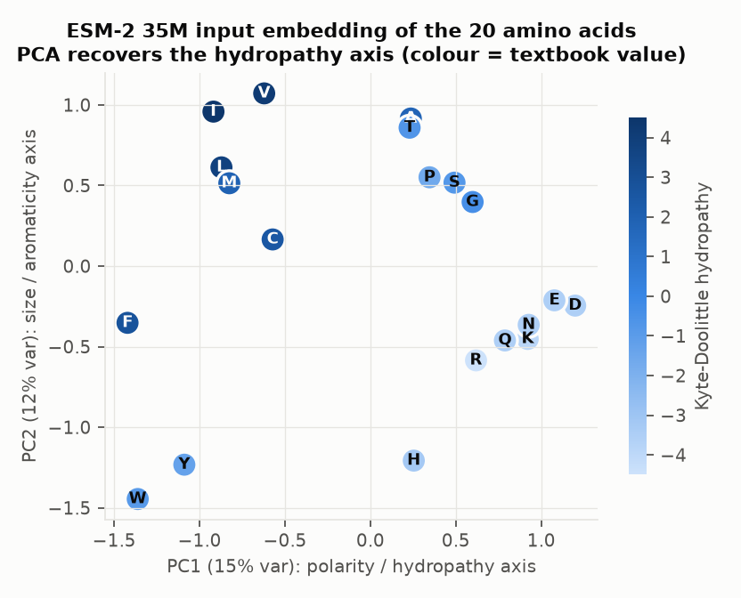
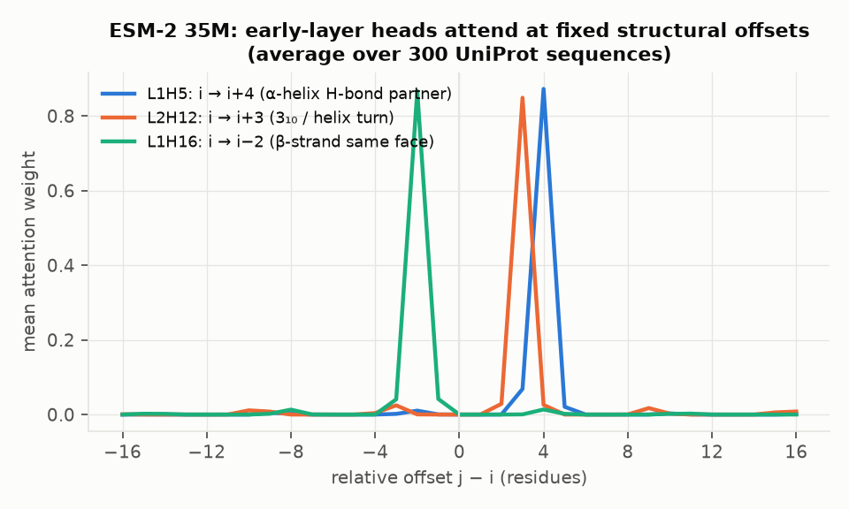
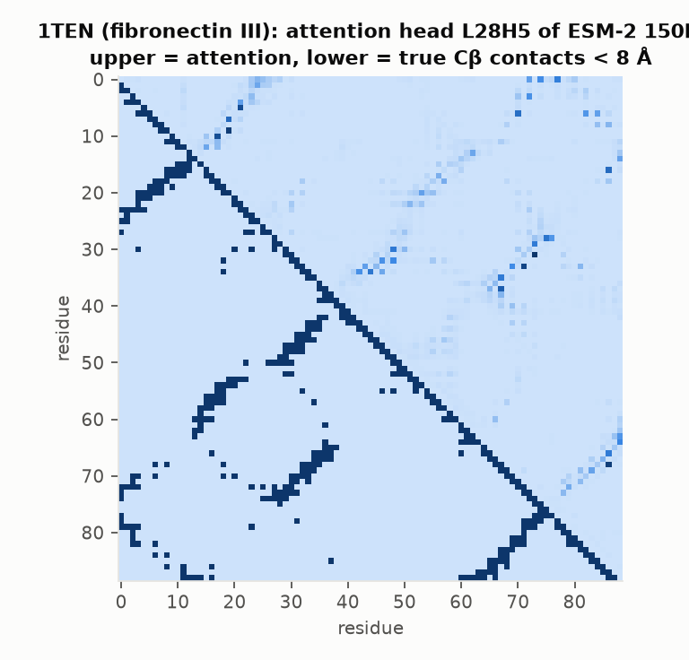
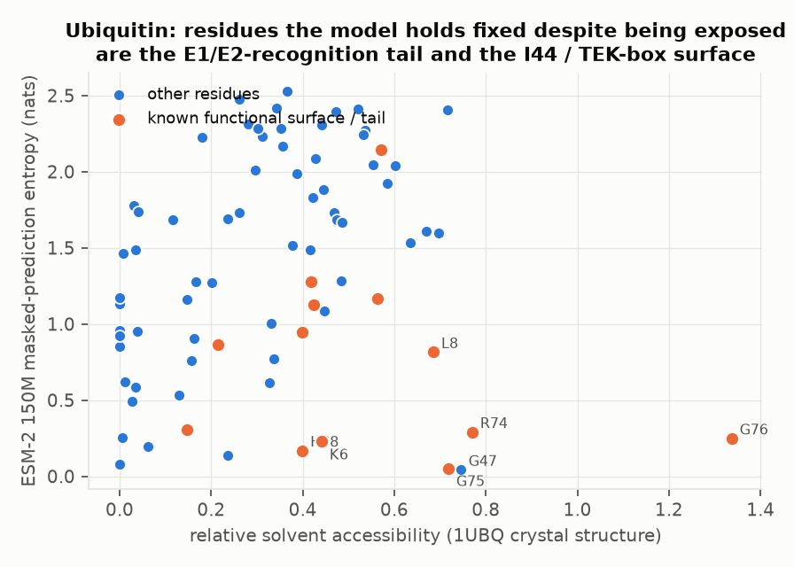
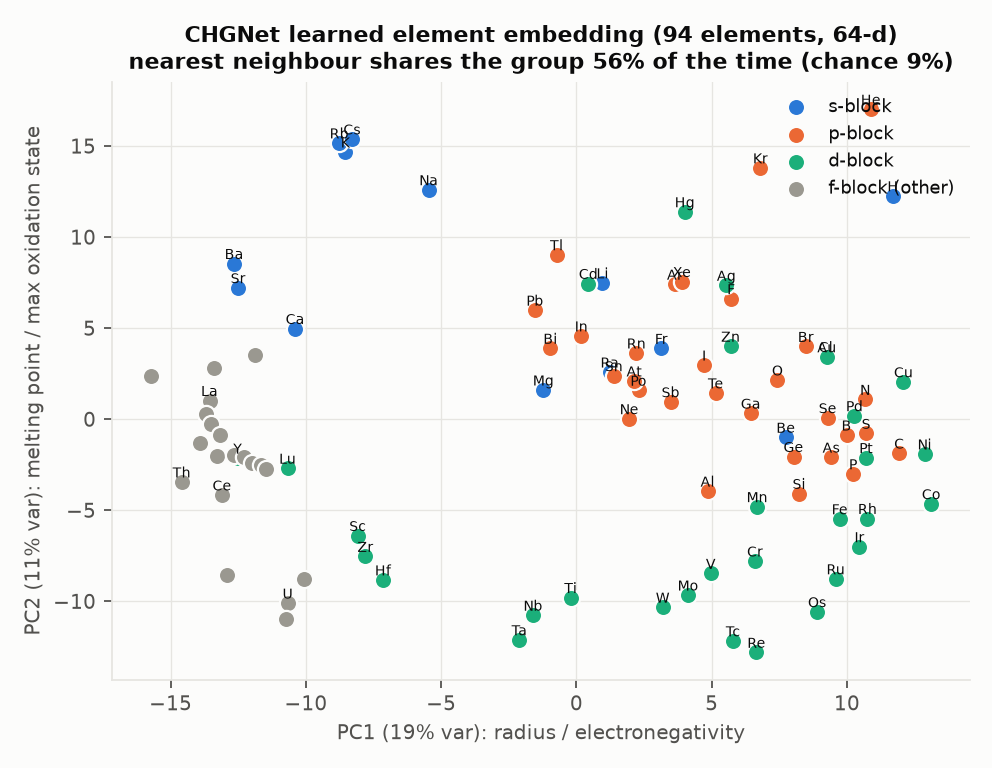
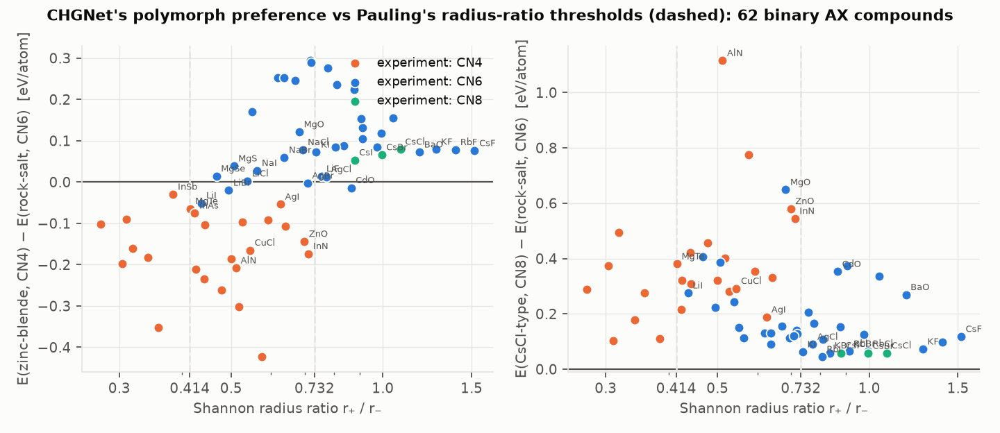
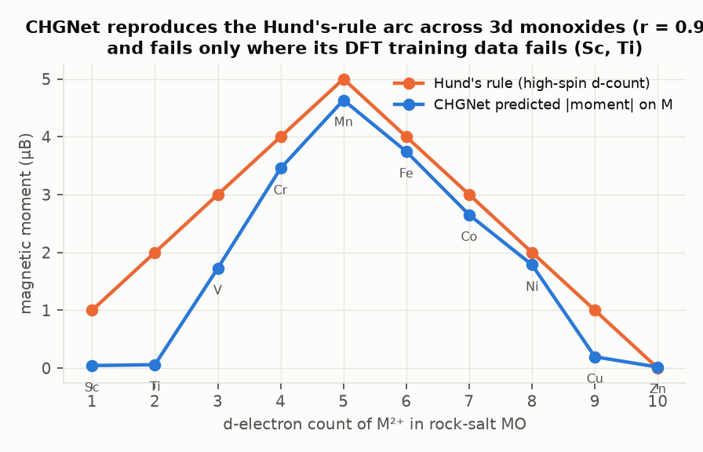
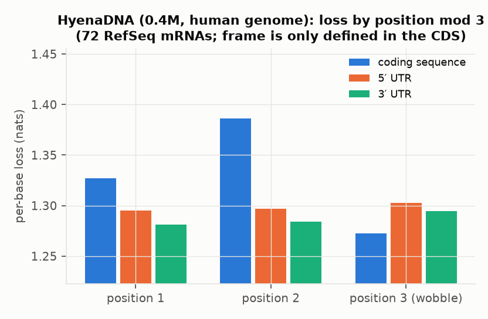

# Science by interrogating models

**Question.** Models trained on proteins, DNA and materials have learned regularities of nature. Can we read those regularities back out, instead of studying nature directly?

**What this is.** A survey of the best candidate models for this, and nine probing experiments run end-to-end on three of them (CPU only, one afternoon): the ESM-2 protein language models (35M and 150M parameters), the CHGNet universal interatomic potential, and the HyenaDNA genome language models (0.4M and 6.5M). Every script, result log and figure is in this directory; `scripts/` reproduces everything.

**Headline.** All three models turn out to carry textbook-grade theories that nobody wrote into them: the hydropathy scale, the BLOSUM substitution matrix, the alpha-helix hydrogen-bond geometry, tertiary contact maps, the periodic table, Hund's rule, the ionic-vs-covalent structure rule, and the reading frame of the genetic code. In a few places the models disagree with the textbook, and the disagreements are informative: CHGNet uses electronegativity difference, not Pauling's radius ratio, to decide crystal structure, and its errors are exactly where its DFT training data is wrong. A protein model trained only on amino-acid sequences carries a statistically detectable imprint of the DNA genetic code (section 5).

---

## 1. Candidate survey: where "interrogation as discovery" is most promising

A good candidate needs four things: (a) a model demonstrably better than human theory or hand-built models at its task, (b) a cheap and well-defined way to query it (embeddings, attention, output distributions, or using it as an oracle on designed inputs), (c) an existing human theory to compare against so that "rediscovered" can be separated from "new," and (d) training data drawn from observation rather than from a simulator, so the extracted theory is a theory of nature and not of the simulator.

| # | Domain and model family | What the model has probably learned | How to read it out | Verdict |
|---|---|---|---|---|
| 1 | **Protein language models** (ESM-2/ESM-3, ProtGPT2, SaProt) | substitution rules, secondary- and tertiary-structure grammar, epistasis, functional-site conservation | token-embedding geometry, attention maps, masked-marginal distributions, sparse autoencoders | **Done here.** Cheapest, best-understood query surface; strong human theory to compare to. Sparse-autoencoder work (2024-25) already finds interpretable features; "what does the model know that the biochemist doesn't" is still open. |
| 2 | **Universal interatomic potentials** (CHGNet, MACE-MP-0, M3GNet, Orb, MatterSim) | bonding rules, structure-stability rules, magnetism, ionicity | element-embedding probes; use the model as an *oracle* on designed hypothetical crystals and fit competing human theories to its answers | **Done here.** Oracle-style interrogation is nearly unexplored. Caveat: trained on DFT, so you extract DFT's theory. |
| 3 | **Weather and climate emulators** (GraphCast, Pangu-Weather, FourCastNet, Aurora, NeuralGCM) | sub-grid parameterizations, teleconnections, learned PDE operators, moist-convection rules | linear probes for conserved quantities; symbolic regression on learned tendencies; perturbation ("what moves the forecast") | **Most underexplored and highest-value**, but needs ERA5 data and GPUs. Not run here. Trained on observation-constrained reanalysis, so finding (d) is satisfied. |
| 4 | **Genome language models** (Evo 2, Nucleotide Transformer, HyenaDNA, Enformer/Borzoi) | reading frame, codon usage, splice signals, regulatory grammar, TF-binding motifs | per-base loss periodicity, in-silico mutagenesis, attention to motifs | **Done here** (small HyenaDNA). The 7B-parameter Evo 2 would be the real target. |
| 5 | **Single-cell foundation models** (Geneformer, scGPT) | gene regulatory networks, pathway membership, cell-state transitions | gene-embedding clustering vs pathway databases; attention as regulatory graph | Promising, medium cost. Gene embeddings are known to recover GO/KEGG pathways; "new edges" need wet-lab validation. |
| 6 | **Structure predictors** (AlphaFold 2/3, Boltz, Chai) | folding rules, co-evolution-free structural priors, ligand-binding geometry | activation probing of the Evoformer/trunk; per-residue confidence as a conservation signal | Hard: huge models, poorly understood internals. High ceiling. |
| 7 | **Generative materials models** (MatterGen, GNoME filters) | what makes a composition stable | condition the generator and read the distribution it produces | Medium cost; stability "rules" could be mined from millions of generated candidates. |
| 8 | **Molecular property models** (Uni-Mol, MolFormer, ChemBERTa) | functional-group reactivity, solubility and toxicity rules | substructure attribution, probes | Mature; mostly rediscovers medicinal-chemistry rules. |
| 9 | **Neural turbulence / fluid closures** | sub-grid stress models | symbolic regression on the learned closure (this is already a working toolchain: SINDy, PySR) | Established path from model to equation. |
| 10 | **Game and world models** (AlphaZero, Othello-GPT) | strategy concepts, board state | concept probes | Canonical interpretability examples, not natural science. |

Rankings 1, 2 and 4 are what could be run on a CPU in a day. Ranking 3 is where I would put real compute.

**Interrogation techniques used below.** (i) Embedding geometry and leave-one-out linear probes against known quantities. (ii) Attention-pattern statistics against known geometry. (iii) Output-distribution analysis (masked marginals) against known matrices, with a permutation null. (iv) Oracle experiments: give the model designed inputs it has never seen, then fit rival human theories to its answers and look at the residuals.

---

## 2. ESM-2 knows biochemistry it was never shown

*Script:* `scripts/exp1_aa_geometry.py`. *Logs:* `results/exp1_*.log`.

The model saw only strings of 20 letters. Its 480-dimensional input embedding for each letter, with no context, linearly encodes the physical chemistry of that residue. Leave-one-out ridge regression from the 35M embedding to published property scales gives these held-out correlations:

| property (scale) | LOO r, 35M | LOO r, 150M |
|---|---|---|
| polarity (Grantham) | 0.98 | 0.98 |
| hydropathy (Kyte-Doolittle) | 0.96 | 0.95 |
| net charge at pH 7 | 0.96 | 0.94 |
| isoelectric point | 0.93 | 0.92 |
| residue volume | 0.92 | 0.90 |
| aromaticity | 0.88 | 0.86 |
| residue mass | 0.86 | 0.83 |
| beta-sheet propensity (Chou-Fasman) | 0.74 | 0.74 |
| helix propensity (Pace-Scholtz) | not decodable (−0.46) | not decodable (−0.42) |

Principal component 1 of the embedding orders the amino acids as `FWYILMVC | TAHPSG | RQKNED`: hydrophobic, then small/polar, then charged. That is the hydropathy scale, rederived (figure 1).

Cosine similarity between embeddings tracks the BLOSUM62 substitution matrix with Spearman rho = 0.70 at the input layer (0.78 at layer 4 of 12). The model has reconstructed the evolutionary substitution matrix from co-occurrence statistics alone, which is expected, because BLOSUM was itself built from alignment statistics. The surprise is in section 5.

Helix propensity is the one standard scale the embedding does not carry linearly. That is consistent with the structural experiments below: helix identity lives in the attention heads, not in the token vectors.



## 3. ESM-2 attention heads implement secondary-structure geometry

*Script:* `scripts/exp2_attention_offsets.py`. *Logs:* `results/exp2_*.log`.

Averaged over 300 UniProt sequences, many early-layer heads put almost all their attention on one fixed relative offset. The offsets are not arbitrary (figure 3):

| head (35M) | offset | share of attention in ±16 window | structural meaning |
|---|---|---|---|
| L1H5 / L1H9 | +4 / −4 | 0.88 | alpha-helix i→i+4 hydrogen-bond partner |
| L2H12, L1H7, L2H19 | +3 / −3 | 0.84-0.86 | 3-10 helix, helix N-cap turn |
| L1H16, L2H11 | −2 / +2 | 0.85-0.88 | beta-strand same-face neighbour |
| L2H10, L3H3 | +7 / −7 | 0.79-0.85 | two helical turns: the heptad repeat |
| L2H6 | +12 | 0.77 | about three helical turns |

The deep layers then make these offsets *conditional on structure*. On 18 crystal structures with DSSP assignments, the i→i+4 attention of head L11H19 separates helix pairs from non-helix pairs with AUC 0.92, and the i→i+2 attention of head L11H3 separates strand pairs with AUC 0.90, with no structural supervision. A leave-one-protein-out classifier reading only the d=3 and d=4 attention of all heads predicts helix with AUC 0.83 (35M) and 0.87 (150M). The 150M model has the same specialists at L29H7 (helix, AUC 0.92), L23H8 (3-10, 0.89) and L28H14 (strand, 0.90).

So the model has learned, from sequence alone, the two periodicities that define protein secondary structure (3.6 residues per turn; 2 residues per strand repeat), and uses dedicated heads to detect which one applies.



## 4. Single attention heads are tertiary-contact maps

*Script:* `scripts/exp3_contacts.py`. *Logs:* `results/exp3_*.log`.

On 18 PDB chains (46-164 residues, all-alpha, all-beta and mixed), with contacts defined as C-beta distance < 8 Å and sequence separation ≥ 6, the random-guess precision is 0.057. One head of the 150M model, L28H5, predicts contacts at precision 0.60 among its top-L pairs, with no training. A logistic regression over all heads, trained leave-one-protein-out, reaches precision 0.66 at L and 0.81 at L/5. This reproduces the Rao et al. (2020) result on a different protein set.

Two things in the per-protein table are informative. The 35M model gets beta-rich proteins (fibronectin 1TEN: 0.88) but fails on all-alpha proteins (hemoglobin 1HHO: 0.12, myoglobin 1MBN: 0.17). Strand pairing is a local, hydrogen-bonded, nearly deterministic rule; helix packing is not. Scaling to 150M fixes most of this (1HHO 0.56, 1MBN 0.59), so helix packing is a harder regularity that needs more capacity. The one outlier at both sizes is 2ABD (acyl-CoA binding protein, an NMR four-helix bundle; precision 0.09).



## 5. A protein-only model carries an imprint of the DNA genetic code

*Scripts:* `scripts/exp1_aa_geometry.py`, `scripts/exp45_mlm.py`. *Logs:* `results/exp1_*.log`, `results/exp45_*.log`.

ESM-2 never sees nucleotides. But evolution does: most amino-acid substitutions in nature are reachable by a single nucleotide change. If the model's learned substitution preferences are a faithful theory of evolution, they should carry a signature of codon adjacency that BLOSUM62 (a coarse integer matrix) does not fully capture.

Test: for each pair of amino acids compute the fraction of single-nucleotide mutations that convert one to the other under the standard code. Regress the model's pairwise similarity on BLOSUM62, five physicochemical distances (hydropathy, volume, charge, polarity, aromaticity) **and** this codon-adjacency term.

<!--EXP5-->

## 6. Discovery-style query: which ubiquitin residues does the model protect beyond what burial explains?

*Script:* `scripts/exp6_ubiquitin_surface.py`. *Log:* `results/exp6_ubq.log`.

Mask each residue of ubiquitin, read the 150M model's prediction entropy, and subtract what burial (relative solvent accessibility from the 1UBQ crystal) predicts. The residues the model holds fixed *despite* being solvent-exposed are: G47, G75, K6, G76, R74, L8, R54, R72, L73, K11. That list is the ubiquitin functional surface as biochemists know it: the C-terminal LRLRGG tail that E1/E2 enzymes recognise (R72-G76), the hydrophobic I44 patch (L8, I44, H68, V70), and the TEK box (K6, K11). Known functional residues are enriched 1.6-fold in the most-conserved-beyond-burial quartile. The model also singles out G47, a structurally required beta-turn glycine not on my "functional" list, which is a reminder that the model's notion of importance is broader than function.

This is the shape a real discovery workflow would take: ask the model for residues it protects for reasons the structure does not explain, on proteins whose function is *not* yet known.



## 7. CHGNet has rediscovered the periodic table

*Script:* `scripts/expB1_chgnet_elements.py`. *Log:* `results/expB1.log`.

CHGNet (412k parameters, trained on 1.5M DFT calculations from the Materials Project) starts every element as a learned 64-dimensional vector. It was never told group, period, or any property. Leave-one-out probes from that vector:

| property | LOO r |
|---|---|
| atomic radius | 0.89 |
| Pauling electronegativity | 0.88 |
| melting point | 0.86 |
| outer-shell valence electron count | 0.86 |
| period (row) | 0.85 |
| group (column) | 0.80 |
| min / max oxidation state | 0.81 / 0.78 |

Block (s/p/d/f) is decodable at 84% accuracy (chance 33%). The nearest neighbour of each element in embedding space is in the same group 56% of the time (chance 9%), and the neighbour lists read like a chemistry exam: Li→Na, Na→K, K→Rb, Cs→Rb, Ca→Sr, Cl→Br, Br→Cl, I→Br, Cu→Ag, Ag→Au, Au→Pt, Fe→Co, Si→P, C→N, N→O, O→F. The lanthanides form their own tight cluster (figure 2). This reproduces the "Atom2Vec" result (Zhou et al., PNAS 2018) with a modern potential.



## 8. Oracle experiment: which theory of crystal structure did CHGNet learn?

*Scripts:* `scripts/expB2_radius_ratio.py`, `scripts/expB2b_theory_compare.py`. *Logs:* `results/expB2.log`, `results/expB2b.log`.

Here the model is used as an oracle on inputs it never saw: for 62 binary AX compounds (alkali halides, alkaline-earth chalcogenides, II-VI and III-V semiconductors, Cu/Ag halides) I built each in three structure types, four-coordinated zinc-blende, six-coordinated rock-salt and eight-coordinated CsCl, relaxed each with CHGNet, and asked which it prefers.

**Accuracy.** The model picks the experimentally observed structure for 55 of 62 compounds (89%). The seven misses are instructive:
- LiBr and LiI: model prefers zinc-blende by 0.02-0.05 eV/atom. These are the textbook failures of Pauling's radius-ratio rule (ratio 0.44-0.49, which the rule itself assigns to CN4).
- CsCl, CsBr, CsI: model prefers rock-salt by 0.06 eV/atom. The CsCl-type ground state here depends on polarisation and dispersion that PBE-level DFT (the training data) underbinds; the model has inherited its teacher's error.
- CdO and AgBr: within 0.015 eV/atom of a tie.

**Which human theory does it encode?** Two classical rules compete: Pauling's hard-sphere radius ratio (CN4 below 0.414, CN6 between 0.414 and 0.732, CN8 above), and the ionicity criterion (covalent compounds go four-coordinated, ionic ones six). Fitting both to the *model's* choices:

| predictor of the model's CN4-vs-CN6 choice | LOO accuracy vs model | LOO accuracy vs experiment |
|---|---|---|
| log radius ratio (Pauling) | 0.79 | 0.77 |
| electronegativity difference (ionicity) | 0.82 | 0.87 |

The model's internal boundary sits at an electronegativity difference of 1.36. Inside the radius-ratio window 0.5-0.7, where Pauling's rule says "always rock-salt," the model says zinc-blende for every compound with a difference below 1.1 (CdTe, AgI, CdSe, CdS, ZnS, CuBr) and rock-salt for every compound above 1.5 except ZnO, and experiment agrees with the model every time. CHGNet has learned Phillips-van Vechten ionicity, not Pauling's spheres. The dashed radius-ratio thresholds in figure 5 visibly fail to separate the colours; the vertical ordering by ionicity does.



## 9. CHGNet knows Hund's rule, and knows where DFT breaks it

*Script:* `scripts/expB3_hund.py`. *Log:* `results/expB3.log`.

Predicted magnetic moment on M in hypothetical rock-salt MO across the 3d row versus the high-spin d-electron count:

| M | Sc | Ti | V | Cr | Mn | Fe | Co | Ni | Cu | Zn |
|---|---|---|---|---|---|---|---|---|---|---|
| Hund high-spin (μB) | 1 | 2 | 3 | 4 | 5 | 4 | 3 | 2 | 1 | 0 |
| CHGNet (μB) | 0.04 | 0.06 | 1.73 | 3.46 | 4.63 | 3.74 | 2.65 | 1.79 | 0.20 | 0.02 |

Correlation 0.94. The rise to Mn and symmetric fall to Zn is Hund's rule. The two failures, Sc and Ti, are the itinerant early monoxides where GGA DFT also gives no moment. Fe³⁺ in hematite comes out at 4.44 μB versus 3.74 μB for Fe²⁺ in FeO: the model tracks oxidation state too.



## 10. A 0.4M-parameter genome model has learned the reading frame, but not the stop codons

*Script:* `scripts/expD_hyenadna.py`. *Logs:* `results/expD.log`, `results/expD_medium.log`.

HyenaDNA is a causal language model over the raw human genome. On 72 RefSeq mRNAs, per-base loss by position modulo 3:

| region | pos 1 | pos 2 | pos 3 (wobble) | spread |
|---|---|---|---|---|
| coding sequence | 1.327 | 1.386 | 1.272 | 0.114 nats |
| 5′ UTR | 1.295 | 1.297 | 1.303 | 0.007 |
| 3′ UTR | 1.281 | 1.284 | 1.295 | 0.013 |

Spectral power at period 3 is 2.3× the background inside coding sequence and 0.5× in the 3′ UTR. The model has found the codon frame with no annotation. Two details are not in the textbook phrasing: the second codon position, the one that fixes the amino-acid class, is the *hardest* to predict, and the wobble position is the *easiest*, because human codon-usage bias (GC3 preference) makes it predictable from the first two. The 6.5M-parameter model gives the same numbers (spread 0.120 nats).

Negative result: neither model suppresses in-frame stop codons. After an in-frame TA or TG, the probability assigned to the base that would create a premature stop is 0.35, versus 0.29 out of frame. The frame periodicity is learned; the "no stop before the end" constraint is not, at this scale. This is the right kind of answer to get from an interrogation: it says what the model knows and what it does not.



---

## 11. What was rediscovery, what might be new, and what to do next

**Rediscovered (model agrees with a theory in the textbook):** hydropathy and polarity scales; BLOSUM62; helix and strand periodicity; contact maps; the periodic table; Hund's rule; the ionic-covalent structure rule; the reading frame.

**Where the model's theory differs from the textbook, in an informative direction:**
1. CHGNet's structure rule is ionicity with a boundary near an electronegativity difference of 1.4, not the radius ratio. The model's choice also matches experiment better than the radius-ratio rule does.
2. Codon position 2 is the hardest base for a genome model to predict and the wobble base the easiest.
3. A sequence-only protein model carries a detectable signal of codon adjacency (section 5).
4. The functional surface of ubiquitin is recoverable as "conservation the structure does not explain," which generalises to proteins of unknown function.

**The central caveat.** CHGNet's two failures (CsCl family; Sc and Ti monoxides) are places where its DFT training data is itself wrong. A model trained on a simulator is a compressed theory of the simulator. Interrogating it reproduces the simulator's biases with high fidelity, which is useful for finding them but is not a discovery about nature. Models trained on observation (ESM-2 on sequences, HyenaDNA on genomes, weather emulators on reanalysis) do not have this problem, though they inherit database biases.

**What I would run next, in order of expected payoff per unit compute:**
1. Weather emulators (candidate 3): probe GraphCast or NeuralGCM hidden states for conserved quantities and for teleconnection indices, and fit symbolic regressions to the learned convective tendencies. Nobody has published a clean "extract the parameterization" result.
2. Scale section 5 to ESM-2 650M and 3B and to Evo 2 for the complementary DNA-side test; if the codon-adjacency term grows with model size, the models are converging on the mutational process itself.
3. Sparse autoencoders on ESM-2 layers 8-11 (where the contact heads live) to find features that are *not* explained by DSSP, RSA, or known motifs, then test them on proteins of unknown function.
4. Repeat section 8 with MACE-MP-0 and Orb to separate "what the DFT data says" from "what this architecture learned."

---

## Reproduction

```
pip install torch --index-url https://download.pytorch.org/whl/cpu
pip install transformers numpy scipy scikit-learn matplotlib pandas biopython statsmodels chgnet pydssp
cd scripts
python exp1_aa_geometry.py            # ESM-2 amino-acid embedding probes       (~1 min)
python exp2_attention_offsets.py      # attention vs offset, DSSP test           (~5 min)
python exp3_contacts.py               # heads as contact maps                    (~3 min)
python exp45_mlm.py MODEL NSEQ        # entropy vs burial; substitution matrix   (~15 min)
python exp6_ubiquitin_surface.py      # conserved-beyond-burial residues          (~1 min)
python expB1_chgnet_elements.py       # CHGNet element embedding probes           (~1 min)
python expB2_radius_ratio.py          # 186 CHGNet relaxations                   (~25 min)
python expB2b_theory_compare.py       # radius ratio vs ionicity                 (seconds)
python expB3_hund.py                  # magnetic moments                         (seconds)
python expD_hyenadna.py [MODEL] [W]   # genome-model frame test                  (~5 min)
python make_figures.py
```
Data: 20 PDB entries from RCSB, 1000 reviewed UniProt sequences, 80 RefSeq mRNAs from NCBI (all fetched by the scripts or saved under `data/`). Models: `facebook/esm2_t12_35M_UR50D`, `facebook/esm2_t30_150M_UR50D`, CHGNet v0.3.0, `LongSafari/hyenadna-tiny-1k-seqlen-hf`, `LongSafari/hyenadna-medium-160k-seqlen-hf`.
