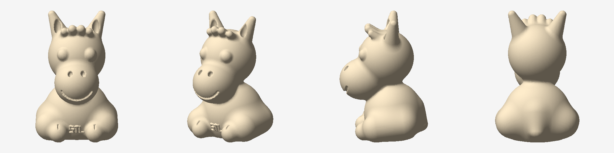

# Sitting pony — 3D printable model

A chunky sitting cartoon pony: oversized muzzle, dome eyes, leaf ears, a row of
mane tufts and an `STL` badge across the chest.



| | |
|---|---|
| File | `sitting_pony.stl` (binary STL, mm) |
| Size | 65 × 72 × 101 mm (W × D × H) |
| Mesh | 225 880 triangles, watertight, manifold, genus 0 |
| Volume | 156 cm³ enclosed — roughly 60 g of PLA at 15 % infill |
| Origin | centred in X/Y, base flat on Z = 0, so it drops straight onto the bed |

## Printing

Print it standing as exported — that is the orientation it was designed for and
it gives a wide flat contact patch across the base, haunches and paws.

* **Layer height** 0.16–0.2 mm. The smallest features (smile groove, embossed
  badge, toe lines) are ~1 mm wide and 0.9–1.2 mm deep, so a 0.4 mm nozzle
  resolves them.
* **Walls / infill** 2–3 perimeters, 10–15 % infill. Nothing is thin enough to
  need more.
* **Supports** recommended, touching build plate only. Two areas need them:
  the underside of the muzzle where it overhangs the chest, and the front faces
  of the mane tufts, which lean forward at about 38° from horizontal. The ears
  lean 22° from vertical and print unsupported.
* **Brim** not needed — the footprint is ~35 cm².
* Everything else is 45° or shallower, so the eyes, tail and paws come out clean
  without help.

### Colour

The muzzle, inner ears and eyes are modelled as separate blended volumes with a
crease where they meet the body, so the slicer's colour-painting tool (Bambu
Studio, PrusaSlicer, OrcaSlicer) snaps to those edges cleanly for a multi-
material print. A single Z-height filament swap will not work — the muzzle
spans the same layers as the chest.

## Regenerating and resizing

The STL is generated, not hand-modelled, so it can be rebuilt at any resolution
or size:

```sh
pip install numpy scikit-image pillow

python3 generate_pony.py                     # 0.5 mm voxels -> sitting_pony.stl
python3 generate_pony.py --voxel 1.5         # fast draft
python3 generate_pony.py --height 150        # scale to 150 mm tall
python3 check_mesh.py sitting_pony.stl       # watertight / manifold report
python3 preview.py sitting_pony.stl out.png  # four shaded views
```

Scaling below about 60 mm tall will start to lose the badge and the smile
groove; scale the `TEXT_*` constants up if you want a small print to keep them.

## How it is built

* `sdf.py` — signed distance primitives (sphere, ellipsoid, round cone,
  capsule) and smooth union / subtract operators.
* `generate_pony.py` — the figure as a single distance field, sampled on a
  regular grid and polygonised with marching cubes. All proportions live in the
  constants at the top of the file.
* `check_mesh.py` — welds the STL and reports boundary edges, non-manifold
  edges, degenerate triangles, Euler characteristic and volume.
* `preview.py` — dependency-free shaded renderer used for the image above.

Because the whole figure is one distance field, the output is a single closed
shell rather than a pile of intersecting bodies, which is what keeps the mesh
watertight. Two details are worth knowing if you edit the model: grid samples
are nudged off zero before polygonising so no crossing lands exactly on a
lattice point (that produces zero-area triangles), and carved grooves must stay
tangential to the surface — an earlier version of the toe lines plunged inward
and pierced the paw shell, turning the solid into genus 2.
